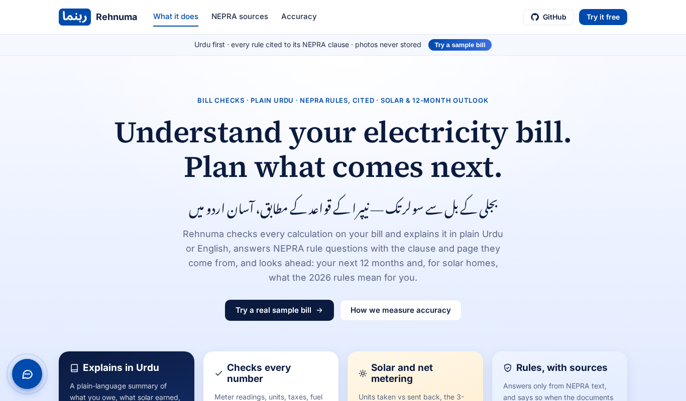
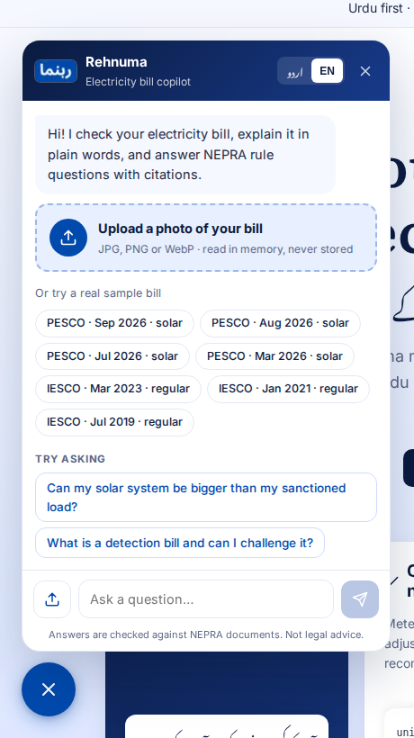
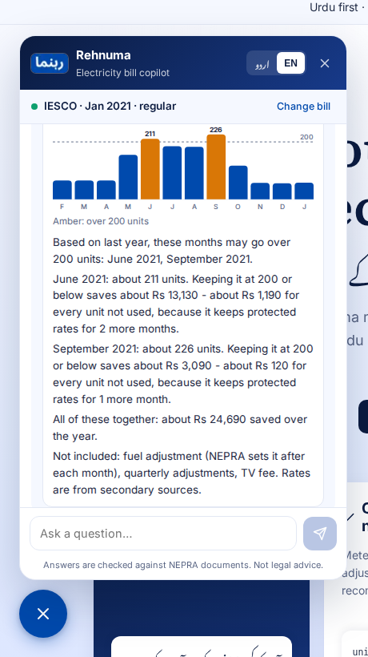
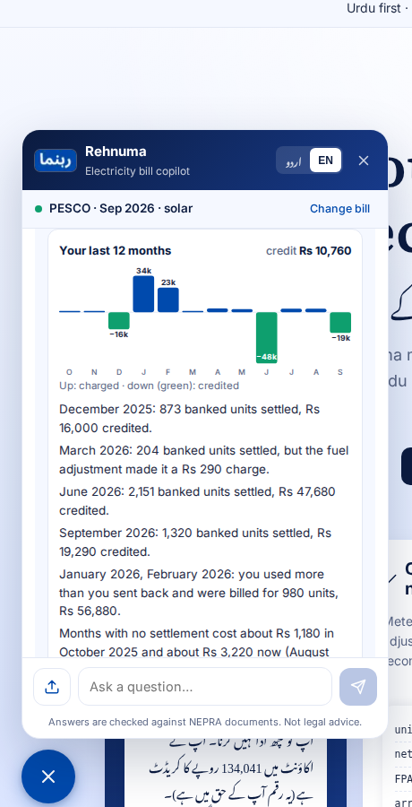
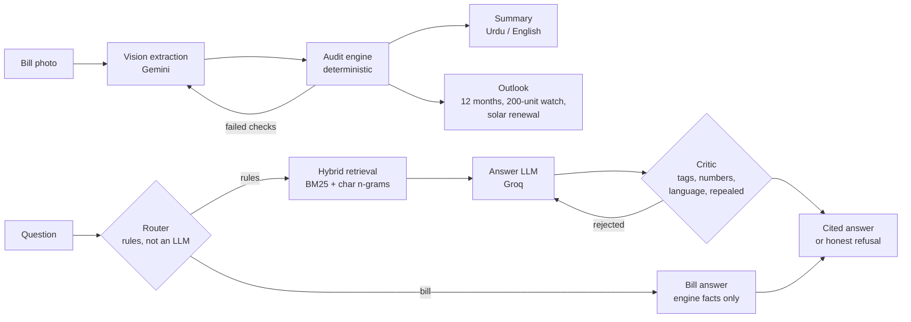

# Rehnuma (رہنما) — an AI copilot for Pakistani electricity bills

**Understand your electricity bill. Plan what comes next.** · *بجلی کے بل سے سولر تک — نیپرا کے قواعد کے مطابق، آسان اردو میں*

[](https://github.com/MoZainUlAbideen/rehnuma/actions/workflows/ci.yml)

**[Live demo](https://rehnuma-kappa.vercel.app)** · [API docs](https://rehnuma-api-3e5t.onrender.com/docs)
(free tier: the first request after a quiet spell takes up to a minute) ·
[How accuracy is measured](https://rehnuma-kappa.vercel.app/accuracy)

Pakistani electricity bills stack slab rates, protected status, fuel adjustments, quarterly
adjustments, fixed charges, duty and GST into one page almost nobody reads - people ask the
lineman. Solar households also face NEPRA's 2026 Prosumer Regulations, which changed what
exported units are worth.

Rehnuma reads a photo of the bill, **re-computes it rupee by rupee with a deterministic
engine**, explains it in plain **Urdu** (or English), answers questions about NEPRA's rules
**with the clause and page they come from**, and looks ahead: the next 12 months for a
regular household, and what renewal would cost a solar one.

| | |
|---|---|
|  |  |
|  |  |

## What it does

- **Audits the bill.** Units from meter readings, the net-metering bank, electricity duty,
  GST, the fuel-adjustment tax cascade, arrears vs history - every line recomputed. A real
  PESCO bill really prints a Rs 2 inconsistency, and Rehnuma shows it.
- **Reads a photo.** Gemini extracts the bill; the audit engine checks the extraction and
  failed checks trigger a re-read. The photo is never stored, and the schema has no field for
  names, addresses or reference numbers.
- **Explains it in Urdu.** A plain summary where every number comes from the engine - a
  faithfulness check rejects any other number.
- **Answers rule questions with citations.** Hybrid retrieval over 566 clauses of 5 NEPRA
  documents, an LLM answer, and a deterministic critic that rejects uncited or unsupported
  claims. It refuses when the documents don't cover a question.
- **Looks ahead.** The next 12 months at today's rates with the **200-unit protected limit**:
  "keeping June at 200 saves about Rs 13,130 - Rs 1,190 per unit not used". For solar
  households: the last 12 months rebuilt from the bill, and what the same meter readings
  would cost on renewal terms.

## Architecture



**Design rule: the LLM never does arithmetic and never has the last word on a fact.** Every
rupee comes from the engine; the LLM writes words, and a deterministic critic checks them.

## Results

All numbers come from evals in this repo; held-out questions were written before tuning and
never tuned on. The ones that need no API key are gated in CI on every push.

| What | Result | Where |
|---|---|---|
| Rule questions answered (held-out, EN + UR) | 100%, 91-100% cite the right clause | [POLICY_EVAL.md](docs/POLICY_EVAL.md) |
| Right clause in the top 5 (held-out, 566 clauses) | 91% English, 83% Urdu (dev) | [POLICY_EVAL.md](docs/POLICY_EVAL.md) |
| Out-of-scope questions refused | 6 / 6 | [POLICY_EVAL.md](docs/POLICY_EVAL.md) |
| Invented numbers reaching a user (summaries) | 0 | [SUMMARY_EVAL.md](docs/SUMMARY_EVAL.md) |
| Fields read correctly from real bill photos | 96.2%, 100% of key fields | [PROGRESS.md](docs/PROGRESS.md) |
| Planted errors caught (2,000 synthetic bills) | 100%, 0% false alarms | [FINDINGS.md](docs/FINDINGS.md) |
| Forecast engine reproduces real bills' energy charges | 3 / 3 | [FORECAST.md](docs/FORECAST.md) |
| Solar months rebuilt from one bill's history | 6 / 6 match their own bills | [FORECAST.md](docs/FORECAST.md) |

**Measured honestly, including what didn't work:** "last year's rupees" as a solar forecast
missed by -68% (so there is no solar rupee forecast); multilingual embeddings didn't beat
lexical retrieval in English; the 12-month forecast's accuracy is reported as n = 0 until
same-household bill pairs exist. Every real bug found - OCR heading variants, a wrong Urdu
rate name, a critic that rejected correct answers, a model that *calculated* a meter bank
instead of copying it - is written up with its fix and a test.

## Engineering

- **Python + uv**, pydantic, exact decimals. 319 tests; ruff; evals as code.
- **Evals in CI** - `rehnuma-ci-evals` gates 20 metrics against committed limits; a metric that
  drops or disappears fails the build ([OPERATIONS.md](docs/OPERATIONS.md)).
- **Tracing** - Langfuse (optional): one trace per question, from the API through routing,
  retrieval, each LLM call and the critic's verdict on every draft. Long numbers masked, photos
  never sent.
- **Policy watcher** - a weekly GitHub workflow re-downloads NEPRA's PDFs, compares SHA-256
  with the lock, and opens a review issue on a change. Nothing updates itself.
- **Live** - FastAPI on Render (Docker), Next.js on Vercel, per-visitor daily limits, cached
  sample answers, free-tier quota handling (a spent daily quota stops instead of retrying).

## Run it locally

```bash
uv sync                                  # create .venv and install everything
uv run pytest                            # run the test suite
uv run rehnuma-audit data/labels/real    # audit all real bills
uv run rehnuma-audit data/labels/real --all   # include every passing check
uv run rehnuma-eval-auditor --n 2000 --seed 42  # auditor eval on synthetic bills
uv run rehnuma-summary data/labels/real          # plain summary, Urdu (default)
uv run rehnuma-summary data/labels/real --lang en --out summary.md
uv run rehnuma-eval-summary --provider groq      # LLM summary + critic (needs .env)
uv run rehnuma-eval-extract                      # bill photo -> verified bill (needs .env)
uv run rehnuma-policy fetch                      # download the NEPRA documents
uv run rehnuma-policy ingest                     # PDFs -> clause-level index
uv run rehnuma-policy search "can my solar be bigger than my sanctioned load"
uv run rehnuma-eval-policy                       # retrieval eval: lexical, no API
uv run rehnuma-eval-policy --rewrite all         # + Groq rewrites questions into NEPRA wording
uv sync --extra dense; uv run rehnuma-eval-policy --dense   # + multilingual HF embeddings
uv run rehnuma-policy ask "کیا میرا سولر منظور شدہ لوڈ سے بڑا ہو سکتا ہے؟"   # cited answer
uv run rehnuma-eval-answer --split heldout       # cited answers + critic + refusals
uv run rehnuma-ask "Why is my bill negative?" --bill data/labels/real/pesco-2026-09.json
uv run rehnuma-ask "کیا میرے بل پر لگا ہوا ایف پی اے قانون کے مطابق ہے؟" --bill data/labels/real/pesco-2026-03.json
uv run rehnuma-eval-route                        # does each question reach the right part?
uv run rehnuma-ci-evals                          # all no-API evals vs their floors (what CI runs)
uv run rehnuma-forecast data/labels/real/iesco-2021-01.json --lang en --table   # next 12 months
uv run rehnuma-eval-forecast                     # backtest, seasonality, engine check
uv run rehnuma-policy watch                      # have NEPRA's PDFs changed? (exit 3 = yes)
uv sync --extra api --extra obs                  # + Langfuse tracing (keys in .env; see docs/OPERATIONS.md)
uv sync --extra api; uv run rehnuma-api          # live API on http://localhost:7860/docs
cd web; npm install; npm run dev                # website on http://localhost:3000
```

`.env` (copy `.env.example`): `GROQ_API_KEY`, `GEMINI_API_KEY`, optional Langfuse keys.

## Repository

```
src/rehnuma/
  engine/       audit checks, tax calculator, cross-bill checks
  extract/      vision extraction with the verify loop
  explain/      bill story, Urdu/English summaries, LLM summary + critic
  policy/       NEPRA sources, clause parser, hybrid retrieval, cited answers + critic, watcher
  assistant/    router, bill answers, the assistant
  forecast/     12-month outlook, 200-unit watch, solar history + renewal
  api/          FastAPI app, rate limits, views
  evals/        every eval + the CI gate
  obs.py        optional Langfuse tracing
web/            Next.js site: home, accuracy page, chat widget
data/           labels (no PII), eval sets, NEPRA clause index, CI limits
docs/           findings, eval write-ups, progress log
```

## Open items

Tracked in [PROGRESS.md](docs/PROGRESS.md): the full photo-extraction run (free-tier quota,
resumes across days), same-household bill pairs for the forecast backtest, rates from NEPRA's
own documents instead of secondary sources, the solar planner, and the fuel-adjustment legal
basis for the policy corpus.

## Privacy

Real bill photos contain the reference number, consumer ID and address. They live in
`data/real/`, which is git-ignored; uploaded photos are read in memory and never stored.
Labels in `data/labels/real/` carry no identifiers, and a test enforces this.

*Not legal or financial advice - confirm with your DISCO or NEPRA.*
